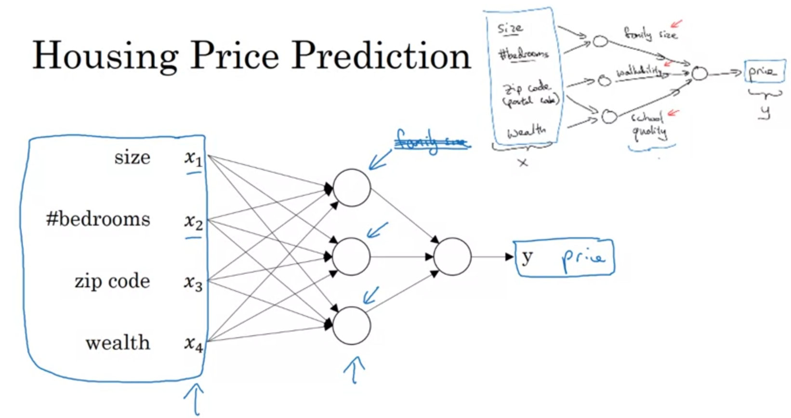
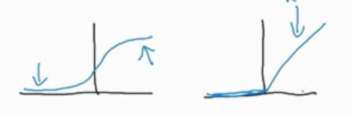
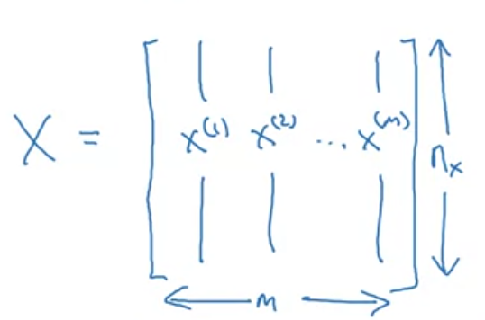
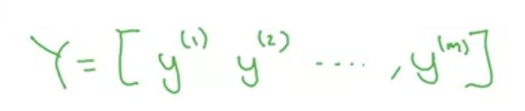
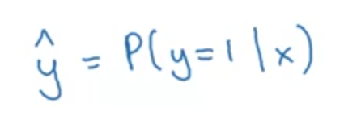
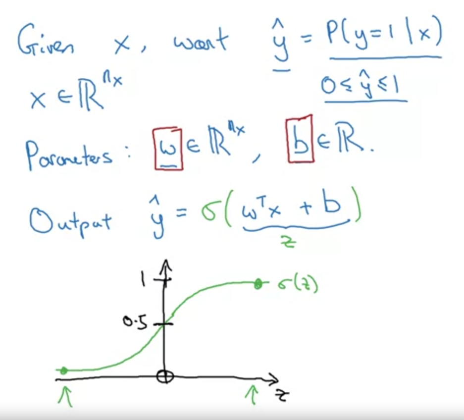
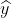
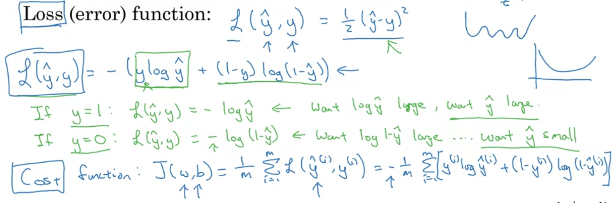
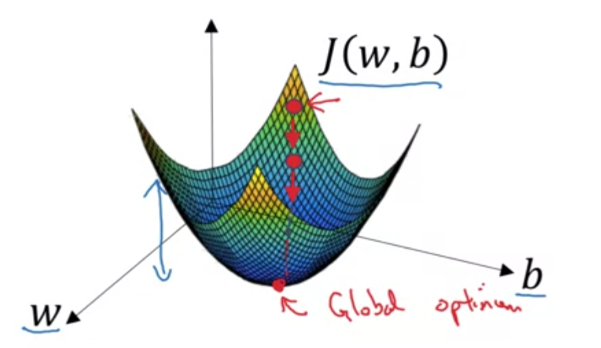
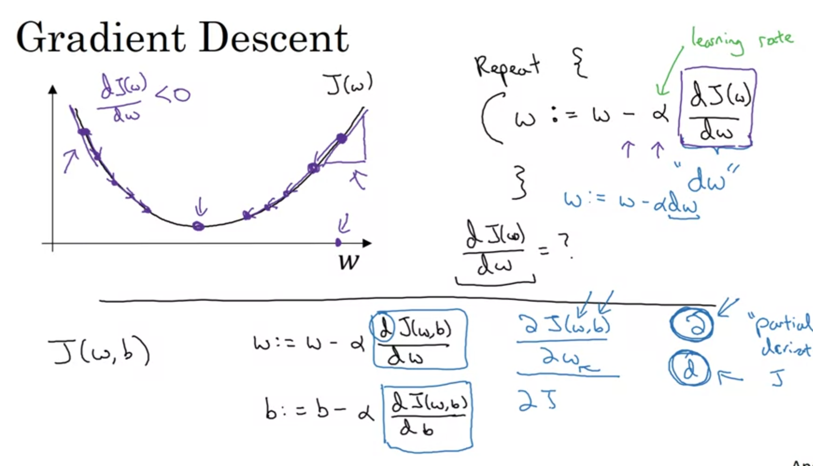

## Neural Networks

  This neural network takes 4 parameters as input and estimates the house price using neurons.

 ## Structured and unstructured data

 Structured: eg. estimating the price of a house using parameters like area, number of rooms (structure members)
 Unstructured: eg. recognizing an image from pixel values. 
 Used in: speech recognition, image recognition,etc

 ## Sigmoid vs RelU
 
 Why is sigmoid not preferred?
 
The slope the sigmoid function is zero at the start and at the later part of the funtcion. Hence, learning becomes very slow at such points.

 ### In RelU
 
In RelU, the gradient of the graph is one.Hence, as compared

 ---
 ## Binary classification
 When categorization is of two types only, either 1 or 0 (true or false)

 ## Logistic regression
 It is an algorithm for binary classification.

## Example
You have to recognize an object either as a cat or non-cat object from an image. (Let the o/p ie. y be 1 in case of a cat and 0 in case of a non-cat) 

# Steps:
1. The image is in the form of RGB channel. The pixel values of each channel is stored in a feature vector x. If the image is 64x64 pixels, the total number of elements in the feature vectors will be 64x64x3(Xn).

2. The process takes in (x,y) where x belongs to n; y is either 1 (cat) or 0 (non-cat)

The Xn (12288) values of 'input x' are lined up in a column. Suppose, there are m training examples, line up previously made columns side by side to form a matrix of order (Xn)x(m).

**The above was the X(input) matrix**

---

3. The output ie., 1s and 0s are stored in a matrix Y of 1 row and 'm' columns.

**The above is the Y(output) matrix.**

---
---

# Logistic Regression

y_hat is the probabilty of output=1 (ie. cat image) given that the input is an image.

## This is actually the weighted sum.

## Sigmoid function

The sigmoid function is used to return the [weighted sum+bias] as a numner between 1 and 0.

Remember: In binary classification, our job is to make the sigmoid funtion return value 1 (and not 0).

In number recognition, it has to be 1 for the correct number while it has to be 0 for the rest. It is the activation number.

# Why cost function?

To get the parameters W and b for the weighted sum, we need a cost function.

---
---

## Loss function

After randomly taking in values for the w and b, we calculate the error in ouputs for the training data is the LOSS FUNCTION.

Remember: When a cost function is used, it makes gradient descent not work well. 

### Input and output to the loss function

input: 

output: 1/2(y-)^2

## Cost function: It is a loss function for 'more than one' training examples. AND WE ALWAYS WANT TO MINIMIZE COST: SUM OF SQUARES

---

## Gradient decent

The value of the loss/cost function should be minimum. This minimum value occurs for a specific value of w and b. To find these values of w and b(which are the parameters of the cost function), we perform gradient decent.

To find the values of w,b for which the cost function is minimum:

Plot 'cost function' v/s 'w'a and 'b' separately.

