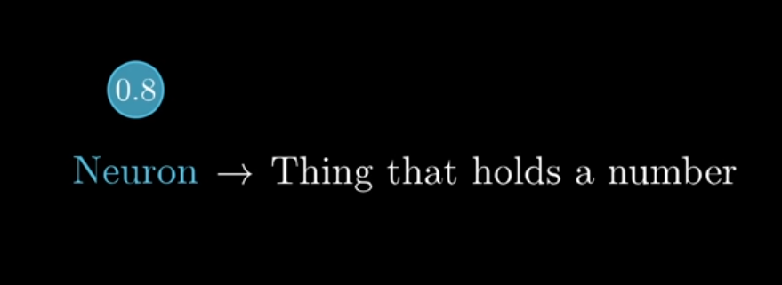
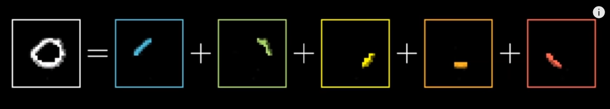
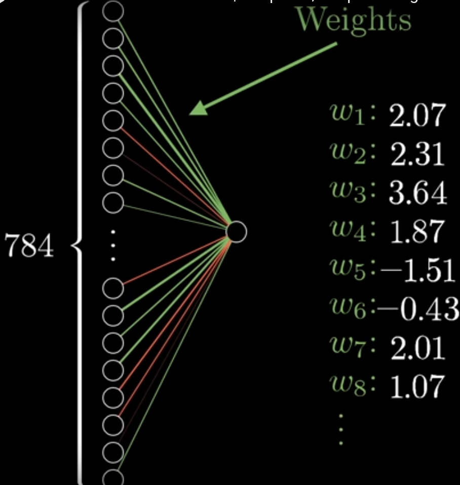
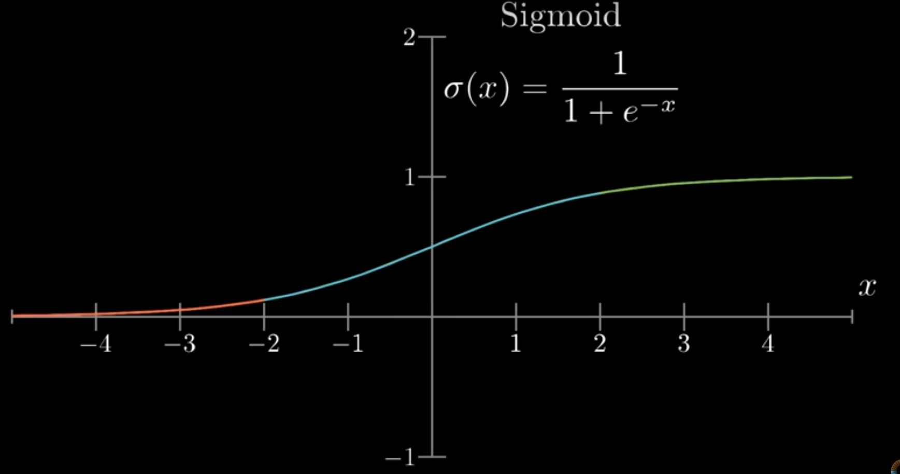
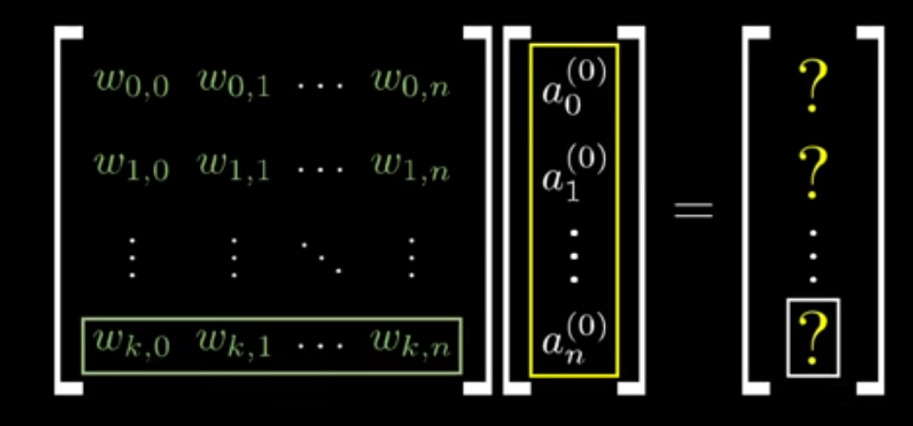
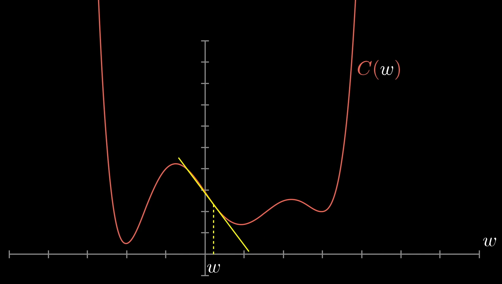
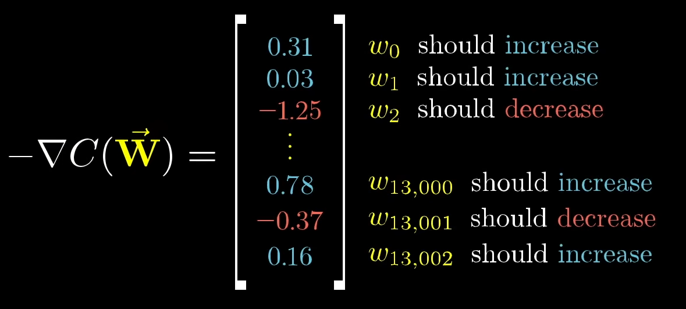
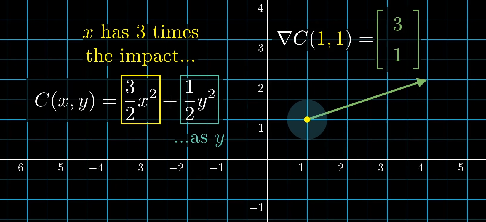
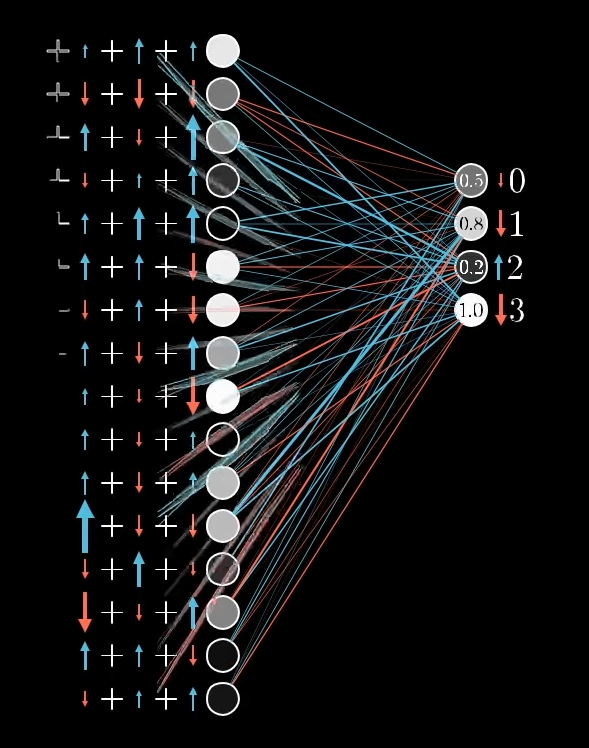

# Neural Networks

## What are neurons?
Consider them to be packets **containing activation numbers.**

## What are activation numbers?
They are values between 0 and 1 which give the intensity of the pixel ie. 0 for black while 1 for white.

### For a 28x28 pixel image, we have 784 neurons in our first layer.

### The second and third layer can contain any number of neurons. 

### Activations in the first layer leads to activation in the middle two layers. The final activation in the output layer gives one digit as output. This is the input digit to be recognized. 

### Why are layers used?
#### The layers help in dividing the input number into parts which can be recognized as loops, straight lines, etc.

 A neuron in any layer (from the second) corresponds to one of the given shapes.

## How to recognize the sub-components (loops)?

We recognize the different edges which make up the sub-component for eg. in a loop

## Taking an eg of number 9

1. The first layer actiavtes only those neurons of the second layer whixh identify the sub-component loop of the number 9.

2. In the third layer, only those neurons are activated which identify the loop and the line of the number 9.

3. In the final layer, the neuron representing number 9 is activated and hence it is the recogized digit.

## How does a neuron detect an edge?

1. Consider a neuron in the second layerhas to conclude whether or not there exits an edge in a particular region.

2. We assign weights to the connection of our neuron in the second layer to each neuron in the first layer.

## Weighted sum

We calculate the weighted sum and to get an output within the range of 0 to 1, we put it as input to the sigmoid function.

## Bias

Before using the sigmoid function, we have a bias to get the weighted sum within a certain range.

## Each neuron in the first layer is connected to all the neurons of the second layer. Each has a different weight and a different bias.

---

### How are the connections between the layers made?

At first the connections are random. Their weights and biases are selected randomly. 

The computer is told that it has made an error by creating a cost function.

1. Suppose, the input to the computer is the number 3, it should have 'activation 1' for the number 3 in its last layer and 'activation 0' for all the other numbers.

2. You add the squares of the differences of 1- the trash activation values (random) and 2-the activation values you want them to have (1 for desired number and 0 for others) 

3. The result is the cost. 

## min cost: Good guessing of numbers

4. The average of all the cost values (obtained from the various 'training' data) is taken. That average cost is the final output cost. 

5. We will obtain the minimum cost when the derivative of the cost function is zero. 

6. Instead of calculating the derivative of a complex function, we can move across its graph. When the slope's line is increasing, we shift to the left for lower value of cost. When it is decreasing, we shift to the right for lower value of cost.

7. There is a gradient vector(multivariable calculus) which helps us find the local minimas of a function. 

The algorithm is:

1. Find the direction os negative slope.

2. Take a small step in the direction of decreasing gradient.

3. Repeat the process.

### This process of lowering the output cost is known as 'Back Propagation'.

## What does each component of input vector depict?

## Example,
### Here the value of x affects the cost function 3 times more than the amount by which y affects it.

## Limitations

1. When given any random input (not a number), it stills gives out a number output.

2. It cannot draw a number given as input. 

---
## Backward Propagation

### Suppose the input number is 2

### 
* For the activation of number 2 to be the highest in the last layer, we should get a high weighted sum for '2'. How is this done?

1. The connections (with the previous layer) linking high activation numbers should be given higher weights. ie. weights of connections should be in proportion with the respective activation.

2. The bias should be inceased for the number 2.

3. The activations of the previous layer should be increased for connections with higher weights.

 ### 
* At the same time, activation (in the last layer) for all the other numbers shoud be decreased. How is this done?

 
Opposite to the above points.

 ---

 
Each of the neurons for the remaining numbers will have their own thoughts on how to change the activation of the neurons of the previous layer. The effect of all the neurons is taken simultaneously and the activation of neurons in the previous layer is changed accordingly. 

 

 ## The average of the nudges desired by each number in the values of weights and biases is used to calculate the negative gradient of the cost function. 

 ## Stochastic gradient descent
 
It takes a lot of time for calculating the data using so many training examples. So the training data is grouped into 100 numbers and the data is calculated. 
