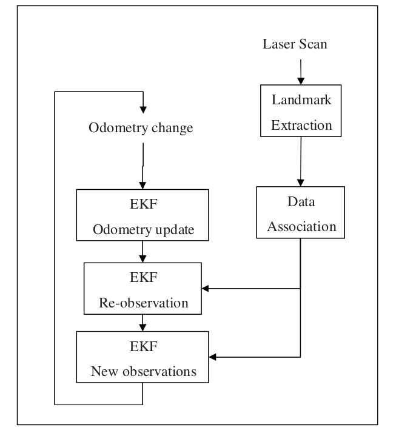

## What is SLAM

SLAM is concerned with the problem of building a map of an unknown environment
by a mobile robot while at the same time navigating the environment using the map.

---
## EKF (Extended Kalman Filter)

In estimation theory, the extended Kalman filter (EKF) is the nonlinear version of the Kalman filter

What is a Kalman Filter?

Algorithm that uses a series of measurements observed over time, including statistical noise and other inaccuracies, and produces estimates of unknown variables

---
## Odometry performance

The odometry performance measures how well the robot can estimate its own
position, just from the rotation of the wheels.

In simple terms, odometry is the use of motion sensors to determine the robot's change in position relative to some known position. For example, if a robot is traveling in a straight line and if it knows the diameter of its wheels, then by counting the number of wheel revolutions it can determine how far it has traveled.

---
## Types of sensors

1. Laser

Drawbacks: Give faulty readings when looked across glass and underwater.

2. Sonar

Drawbacks: Not as accurate as laser but, best choice underwater.

3. Camers

Drawbacks: Gives the best results since it is similar to way humans look at surroundings. Lot of information can be captured.

---
## 

The odometry reults are often not very accurate.

Hence, sensors are used to scan the environment and the bot's surroundings are updated accordingly.

## How does the EKF help in updating the environments?

EKF takes into account the landmarks in the surroundings of the robot. 

As the bot moves, its wheels rotate. Hence, odometry shows a change in position of the bot.

Laser scan and landmark extraction:Then, using sensors (as odometry is not very accurate), landmarks from the surroundings are observed. 

Data association: The robot then compares the new landmarks to the previous ones which it has already seen (at previous locations).

<!-- 

 -->

Re-observed landmarks: The landmarks which were also observed at previous locations are already present in the EKF.

Newly observed landmarks: The landmarks which have appeared for the first time at the current location are updated to the EKF as new observations.

Odometry change: After taking into account all the sensor results, the odometry results (which were less accuarte) are then updated to make more correct.

## Laser Outputs

The output from the laser scanner tells the ranges from right to left

## Odometry and Sensors parallel

The difficult part about the odometry data and the laser data is to get the timing
right.(ie. the odometry of bot and resluts given by sensors 'at the same istant' should be compared.

To overcome this, the odometry results are extrapolated. (The sensor ones are not because it is difficult to predict their results by simple extrapolation)

## Landmarks

They are used by the robot to recognize its position in the surroundings.

Landmarks should be:

re-observable

unique

stationary

