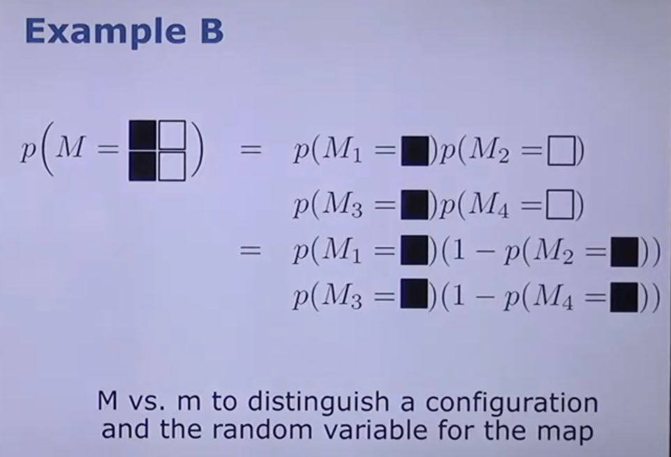

## Occupational Grid Maps

These maps basically tell you which part of the map is occupied and which is not. 

<!-- 

 -->

For eg., the floorplan of a house has coloured rectangles showing the wall. And the empty white space, represents the free space ie. the rooms.
 

white pixels:free space
 

black pixels:occupied area
 

Aim: To derive such occupancy grid maps from real world sensor data.
 
---

## Volumetric v/s Feature occupancy grid map

Volumetric: The free space, in the form of paths, is visible on the map.

Feature: Landmarks in the form of dots are seen on the occupancy grid map.

---
## Mapping

We can get a map from:

1. Sensor data

2. Control commands

---
## Mapping with pose information only

Occupancy grid cells are like floor tiles. Each cell can either be occupied or unoccupied.

### Probability : Binary variable (either occupied or not)

The probability of a grid cell being occupied is p(mi)

When p(mi)=0.8, it is considered to be 1.

When p(mi) is not knonw or there are discrepancies, it is assigned the value of 0.5

Since the probability is binary, P(occupied)=1-P(not occupied)

### How do grid cells with different probability look

---

## Assumption 2

World doesn't move or change. Once a grid cell has a certain probability of occupation, it will remain same throughout.

## Assumption 3

Probability of each grid cell is independant if its surrounding grid cells.

---
## Overall occupancy probability as a function of each cell's probability

eg.

---

The RHS is made up of binary variables.

The LHS is a set of all the probability outputs.

---

After doing all the calculations, we get

LHS= new state of a cell 'i' at time 't'

inv_sensor_model(...)= s=what the sensors are seeing at that instant

l(t-1)(i)= Analogy with the LHS term: It is the old value the cell 'i' had

lo= prior information

Using a laser sensor, the initial part of the graph shows that there is free space and the probability is 0.

When the rays of the laser encounter a wall, the rays are reflected back and hence the wall is detected. The probability of occupancy is thus said to be 1 there.

The part of the graph beyond the wall cannot be detected due to obstruction by the wall. And, we dont know how thick the wall is. Hence, the probability of occupancy further cannot be known an dhnece is given the value of 0.5

---
## Kalman Filters

Why to use?

It helps us predict what the system will do next.

Advantages of Kalman filters

1. Fast computation.

2. No need of history of data.

3. Even with lots of noise/error, it will give good results.

Step 1: Predict

In this step, an estimation of the current state of the system is made using the previous value (not the ones before the last)

Step 2: Update

The 'actual values' from sensors like lidar are taken.

Then, calculate the difference between the measured and the predicted values. Using the 'Kalman Gain', come to a conclusion on which value is more correct.

This process is continued until the predicted and measured values become equivalent.

## Problem with Kalman filters

They do not have any angle parameters. Hence, they do not work for non-linear systems.

---
## Extended Kalman Filter

Extended Kalman Filter makes the non linear function into linear function using Taylor Series , it helps in getting the linear approximation of a non linear function.

In extended Kalman filter the approximation was done based on a single point i.e means . This approximation may not be the best possible approximation and lead to poor performance.

---
## Localization
<!-- 

 -->

Process of estimating where the bot is in its environment.

## Particle Filter

It is based upon the Monte Carlo method.

What is the difference between EKF and particle filter?

EKF can be used only for gaussian distributions. Whereas, the Monte Carlo method can be used generally.

---
## How do particle-based filters work?

The places where partciles are dense, there is greater probability of the system being there.

The places where there is a higher probability of the system being present will have higher weights. (ie. the size of the particles present there would be largest)

## Sampling Principle

The blue curve is the target curve f(x) which tells us exacly the probability of the system being present at that point.

The red curve is the pi-curve/ proposal curve - pi(x)

The weight is defined as f(x)/pi(x)

---
## Prediction and update in particle filter

Step 1: Two empty containers, one for each function.

# Monte Carlo Explanation

Particles are assumed to be present on every spot of the map.

Using the weights, the  particles which have higher probability are given more importance.

The red readings are gotten by sensor values.

The last readings mean: Higher weights are given to those parciles which occur at the peak of the graph.

## AMCL 

amcl is a probabilistic localization system for a robot moving in 2D. It implements the adaptive (or KLD-sampling) Monte Carlo localization approach, which uses a particle filter to track the pose of a robot against a known map.

